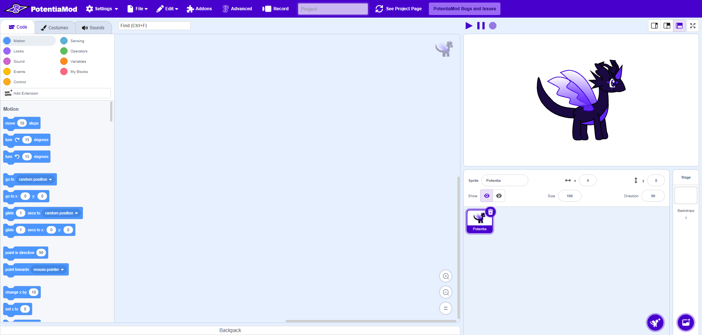

#  some *PotentiaMod* text
## It Makes the Very Best!
> Meet `PotentiaMod`, Master App of All Scratch Mods!

`PotentiaMod` is a block-based coding app and a mod of `TurboWarp` that contains most capabilities similar to PenguinMod and GaiaMod. 

### Enhancements and Certain Features
*   **A bunch of Addons:** Plans for user-built addons for custom functionally, although all of them are inherited from TurboWarp, PenguinMod, MistWarp, DinosaurMod, AmpMod, 02Engine, and Astra Editor. New addons will be implemented soon.
*   **PotentiaMod:** PotentiaMod had plans for putting features extending beyond those of GaiaMod's. It also plans to put text languages inherited from other mods (and even the new version of Scratch itself) in the future. 